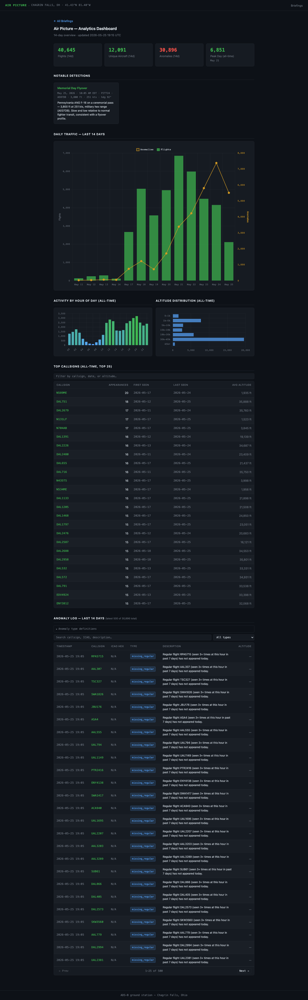
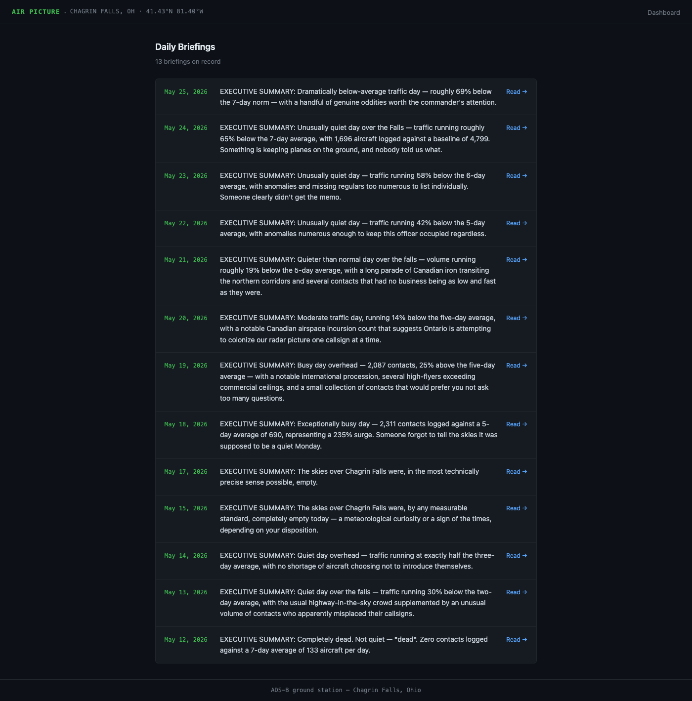

# Air Picture — Aircraft Watch Agent

Monitors aircraft over Chagrin Falls, Ohio throughout the day. Logs all
ADS-B traffic to SQLite, detects anomalies, and generates a daily
intelligence-style briefing via Claude.

## Site

| Dashboard | Daily Briefings |
|-----------|----------------|
|  |  |

## Setup

```bash
cd ~/air-picture

# 1. Create venv and install deps
python3 -m venv .venv
.venv/bin/pip install anthropic
.venv/bin/pip install -e ~/Documents/mcp-sdr

# 2. Configure credentials
cp .env.example .env
# Edit .env — set ANTHROPIC_API_KEY at minimum

# 3. Initialize database
.venv/bin/python agent.py --init

# 4. Test a scan (runs for SCAN_DURATION_MINUTES, default 5)
.venv/bin/python agent.py --scan

# 5. Check status
.venv/bin/python agent.py --status

# 6. Generate a report manually
.venv/bin/python agent.py --report
```

## Scheduling (macOS launchd)

Four LaunchAgent plists live in `~/Library/LaunchAgents/`:

| Plist | Schedule |
|-------|----------|
| `local.air-picture.scan-30min.plist` | Every 30 min, off-peak hours |
| `local.air-picture.scan-morning.plist` | Every 15 min, 7–9 AM |
| `local.air-picture.scan-evening.plist` | Every 15 min, 4–7 PM |
| `local.air-picture.report-daily.plist` | Daily at 10 AM |

Load all agents after initial setup (or after a reboot if they drop):

```bash
for plist in ~/Library/LaunchAgents/local.air-picture.*.plist; do
    launchctl bootstrap gui/$(id -u) "$plist"
done
```

Verify they are running:

```bash
launchctl list | grep air-picture
```

To prevent missed reports when the Mac is asleep, schedule a daily wake 5 minutes before the report fires:

```bash
sudo pmset repeat wake MTWRFSU 09:55:00
```

## Conflict management

The agent writes a PID lock file to `/tmp/sdr_adsb.lock` before accessing
the RTL-SDR dongle. If Claude Desktop is running an ADS-B session, the
launchd job will detect the stale or active lock and skip the cycle cleanly.

## Delivery

| Channel | Config key | Notes |
|---------|-----------|-------|
| File archive | Always on | `~/air-picture/reports/airpicture_YYYY-MM-DD.txt` |
| GitHub Pages | `GITHUB_PAGES` (default `true`) | Rebuilds `docs/` and pushes after each report |
| ntfy.sh push | `NTFY_TOPIC` | Free, no account. Pick any topic name. |
| Facebook page | `FB_PAGE_ID` + `FB_ACCESS_TOKEN` | Reuses scanner-page token |
| Zapier webhook | `ZAPIER_WEBHOOK_URL` | POSTs `{date, report}` JSON |

## File structure

```
air-picture/
├── agent.py        # CLI entry point (--scan / --report / --init / --status)
├── config.py       # All settings + .env loader
├── db.py           # SQLite operations
├── detect.py       # Anomaly detection engine
├── report.py       # Claude API briefing generation
├── deliver.py      # File / ntfy / Facebook / Zapier / GitHub Pages delivery
├── build_site.py       # Static site generator (reads reports/, writes docs/)
├── dashboard.py        # Analytics dashboard builder (writes docs/dashboard.html)
├── screenshot.py       # Headless screenshot tool (updates screenshots/)
├── notable_events.json # Hand-curated notable detections shown on dashboard
├── docs/               # Generated GitHub Pages site (committed)
├── screenshots/        # README screenshots (committed)
├── air_picture.db      # SQLite database (created on --init)
├── reports/            # Daily report archive (gitignored, local only)
└── .env                # Credentials (gitignored)
```
